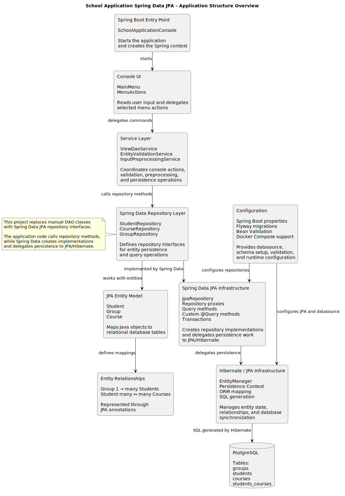

# School Application Spring Data JPA

### Java 21 · Spring Boot · Spring Data JPA · Version 1.0.0

[](https://github.com/Yurii-Kor/school-application-spring-data-jpa/actions/workflows/spring-data-jpa-ci.yml)


Console-based school management application built with Spring Boot, Spring Data JPA repositories, Hibernate, PostgreSQL, Flyway, Bean Validation, Docker, and GitHub Actions.

This project is the fourth step in the School Application learning series. Unlike the Hibernate / JPA version, it no longer implements persistence operations through manual DAO classes or direct `EntityManager` usage in the application layer. Instead, the persistence layer is built around Spring Data JPA repository interfaces.

Spring Data JPA significantly reduces the amount of persistence boilerplate code. Repository interfaces provide common CRUD operations automatically, while custom finder methods and explicit `@Query` declarations cover project-specific queries. This allows the application code to stay focused more on business logic, validation, and user-facing behavior.

The database structure remains the same as in the previous projects, which makes the persistence-layer evolution easier to compare across the series.

For background on the Spring Data JPA repository approach, see the Baeldung guide: [Introduction to Spring Data JPA](https://www.baeldung.com/the-persistence-layer-with-spring-data-jpa).

---
<details open>
<summary><h2>Technology Stack</h2></summary>

| Area                    | Technology                                       |
| ----------------------- | ------------------------------------------------ |
| Language                | Java 21                                          |
| Build tool              | Maven                                            |
| Application framework   | Spring Boot                                      |
| Persistence abstraction | Spring Data JPA                                  |
| Repository API          | `JpaRepository`, repository interfaces           |
| ORM provider            | Hibernate                                        |
| Persistence model       | JPA entities, relationships, persistence context |
| Database                | PostgreSQL                                       |
| Database migrations     | Flyway                                           |
| Validation              | Jakarta Bean Validation                          |
| Testing                 | JUnit 5, Mockito, Spring Test, Testcontainers    |
| Containerization        | Docker, Docker Compose                           |
| CI/CD                   | GitHub Actions, Docker Hub release workflow      |

This project moves persistence from manually implemented DAO classes to Spring Data JPA repositories. Common CRUD operations are provided by repository interfaces, while project-specific queries are expressed through derived query methods and explicit `@Query` declarations.

Compared to the Hibernate / JPA version, this approach significantly reduces the amount of data-access code and allows the application to focus more on validation, business logic, and user-facing behavior.

</details>

---
<details>
<summary><h2>Features</h2></summary>

The service and repository layers support the core school-management operations for groups, students, courses, and student-course enrollments.

Unlike the previous Hibernate / JPA project, persistence operations are no longer implemented through manual DAO classes with direct `EntityManager` usage. Instead, the application delegates data access to Spring Data JPA repository interfaces.

The console UI exposes the following user-facing actions:

* Find all groups with a student count less than or equal to a given number.
* List all students enrolled in a course by course name.
* Add a new student.
* Delete a student by student ID.
* Assign a student to a course.
* Remove a student from one of their courses.

</details>

---
<details open>
<summary><h2>Application Structure</h2></summary>

This diagram shows the main structural blocks of the Spring Data JPA version.
It highlights the transition from manually implemented DAO classes to repository-based persistence through Spring Data JPA.



In this project, the console UI still exposes the same school-management actions, but the persistence layer now works through Spring Data JPA repository interfaces instead of custom DAO implementations.

The main flow is:

```text
Spring Boot Entry Point → Console UI → Service Layer → Repository Layer → Spring Data JPA → Hibernate / JPA → PostgreSQL
```

The PlantUML source for this diagram is stored in:

```text
docs/diagrams/application-structure.puml
```

The rendered SVG diagram is stored in:

```text
docs/diagrams/application-structure.svg
```

</details>

---
<details open>
<summary><h2>Database Schema</h2></summary>

The application uses the same school-management database schema as the previous projects in the series: academic groups, students, courses, and a many-to-many relation between students and courses.


| Table              | Purpose                                  | Seed data                                  |
| ------------------ | ---------------------------------------- | ------------------------------------------ |
| `groups`           | Stores academic groups                   | 10 random groups, IDs start from `100`     |
| `students`         | Stores students assigned to groups       | 200 random students, IDs start from `1000` |
| `courses`          | Stores available courses                 | 10 predefined courses, IDs start from `10` |
| `students_courses` | Join table for student-course enrollment | Each student gets 1–3 random courses       |

The database structure remains unchanged from the earlier repositories in the series. This makes it easier to compare how the persistence layer evolves while the domain model stays consistent.

In this repository, the schema is still managed through Flyway migrations, but application code interacts with the data through Spring Data JPA repositories for entities such as `Student`, `Group`, and `Course`.

The PlantUML source for this diagram is stored in:

```text
docs/diagrams/database-schema.puml
```

The rendered SVG diagram is stored in:

```text
docs/diagrams/database-schema.svg
```

</details>

---
## 🐳 Dockerized Deployment

The application requires PostgreSQL and can be run in two ways:

1. Run the published image from Docker Hub without cloning the repository.
2. Build and run the application locally from the source code.

<details>
<summary><strong>Option 1: Run from Docker Hub</strong></summary>

This option is intended for quickly trying the released application. The source repository is not required.

The commands below are intended for Bash or WSL.

### 1. Pull the released application image

```bash
IMAGE=yuriikorolkov/school-application-spring-data-jpa:1.0.0

docker pull "$IMAGE"
```

The immutable version tag `1.0.0` is recommended for reproducible runs. The `latest` tag points to the most recently published release.

### 2. Create a Docker network

```bash
docker network create school-data-jpa-demo
```

### 3. Start PostgreSQL

```bash
docker run -d --rm \
  --name school-data-jpa-postgres \
  --network school-data-jpa-demo \
  -e POSTGRES_DB=school_console_app \
  -e POSTGRES_USER=school_demo \
  -e POSTGRES_PASSWORD=local-demo-password \
  --health-cmd="pg_isready -U school_demo -d school_console_app" \
  --health-interval=5s \
  --health-timeout=5s \
  --health-retries=10 \
  postgres:16
```

### 4. Wait until PostgreSQL is ready

```bash
until docker inspect \
  -f '{{.State.Health.Status}}' \
  school-data-jpa-postgres \
  | grep -q '^healthy$'; do
  echo "Waiting for PostgreSQL..."
  sleep 2
done
```

### 5. Run the application

```bash
docker run --rm -it \
  --name school-data-jpa-app \
  --network school-data-jpa-demo \
  -e SPRING_DATASOURCE_URL=jdbc:postgresql://school-data-jpa-postgres:5432/school_console_app \
  -e SPRING_DATASOURCE_USERNAME=school_demo \
  -e SPRING_DATASOURCE_PASSWORD=local-demo-password \
  "$IMAGE"
```

The application starts in interactive console mode. Select `q` to exit.

### 6. Clean up the demo environment

```bash
docker stop school-data-jpa-postgres
docker network rm school-data-jpa-demo
```

The PostgreSQL container uses temporary storage in this demo, so its data is removed during cleanup.

</details>

---

<details>
<summary><strong>Option 2: Build and run locally</strong></summary>

This option is intended for development and testing changes made to the source code.

The local startup scripts automatically:

* build the executable Spring Boot JAR;
* optionally run Maven tests;
* validate the Docker Compose configuration;
* build the application Docker image;
* start PostgreSQL;
* run the application in interactive console mode.

Maven tests are skipped by default to make repeated local startup faster.

<details>
<summary><strong>Linux or WSL</strong></summary>

Make the script executable after cloning the repository if necessary:

```bash
chmod +x run.sh
```

### Standard startup

```bash
./run.sh
```

### Startup with Maven tests

```bash
./run.sh --run-tests
```

### Startup with a clean database

```bash
./run.sh --reset-database
```

### Startup with a custom PostgreSQL password

```bash
./run.sh --postgres-password "my-local-password"
```

### Run tests and reset the database

```bash
./run.sh \
  --run-tests \
  --reset-database
```

### Reset the database and use a custom password

```bash
./run.sh \
  --reset-database \
  --postgres-password "my-local-password"
```

### Use all available startup options

```bash
./run.sh \
  --run-tests \
  --reset-database \
  --postgres-password "my-local-password"
```

### Display all supported options

```bash
./run.sh --help
```

</details>

<details>
<summary><strong>Windows PowerShell</strong></summary>

PowerShell may prevent local scripts from running because of the current execution policy. The script can be started for the current invocation without permanently changing the system policy:

```powershell
powershell -ExecutionPolicy Bypass -File .\run.ps1
```

If local scripts are already allowed, use the shorter commands below.

### Standard startup

```powershell
.\run.ps1
```

### Startup with Maven tests

```powershell
.\run.ps1 -RunTests
```

### Startup with a clean database

```powershell
.\run.ps1 -ResetDatabase
```

### Startup with a custom PostgreSQL password

```powershell
.\run.ps1 -PostgresPassword "my-local-password"
```

### Run tests and reset the database

```powershell
.\run.ps1 `
  -RunTests `
  -ResetDatabase
```

### Reset the database and use a custom password

```powershell
.\run.ps1 `
  -ResetDatabase `
  -PostgresPassword "my-local-password"
```

### Use all available startup options

```powershell
.\run.ps1 `
  -RunTests `
  -ResetDatabase `
  -PostgresPassword "my-local-password"
```

The PowerShell options can also be provided on one line:

```powershell
.\run.ps1 -RunTests -ResetDatabase -PostgresPassword "my-local-password"
```

</details>

</details>

---

<details>
<summary><strong>Local environment management</strong></summary>

After the console application exits, PostgreSQL remains available and its data is preserved for the next startup.

### Stop the local environment

Linux or WSL:

```bash
POSTGRES_PASSWORD=local-dev-password \
  docker compose down
```

Windows PowerShell:

```powershell
$env:POSTGRES_PASSWORD = "local-dev-password"
docker compose down
Remove-Item Env:POSTGRES_PASSWORD
```

This stops and removes the containers and network while preserving the PostgreSQL volume.

### Stop the environment and delete the database

Linux or WSL:

```bash
POSTGRES_PASSWORD=local-dev-password \
  docker compose down \
    --volumes \
    --remove-orphans
```

Windows PowerShell:

```powershell
$env:POSTGRES_PASSWORD = "local-dev-password"
docker compose down --volumes --remove-orphans
Remove-Item Env:POSTGRES_PASSWORD
```

This also removes the PostgreSQL volume and all locally stored application data.

The same cleanup can be performed automatically during the next startup.

Linux or WSL:

```bash
./run.sh --reset-database
```

Windows PowerShell:

```powershell
.\run.ps1 -ResetDatabase
```

</details>

---

<details>
<summary><strong>Build and Test without Docker</strong></summary>

This section is intended for local development when PostgreSQL is already available and configured for the application.

Run the test suite:

```bash
./mvnw clean test
```

Build the executable Spring Boot JAR:

```bash
./mvnw clean package
```

Run the packaged application:

```bash
java -jar target/SchoolApplicationDataJPA-1.0.0.jar
```

The application still requires PostgreSQL to be available according to the configured datasource properties. For a fully prepared local environment, prefer the Docker-based startup scripts described above.

</details>

---
## Learning Context and Project Scope

This project is part of a learning series that implements the same school-management domain through progressively higher persistence abstractions:

1. [School Application JDBC](https://github.com/Yurii-Kor/school-application-jdbc) — plain JDBC, SQL, DAO pattern, manual wiring.
2. [School Application on Spring](https://github.com/Yurii-Kor/school-application-on-spring) — Spring Boot with Spring JDBC infrastructure.
3. [School Application Hibernate](https://github.com/Yurii-Kor/school-application-hibernate) — Hibernate / JPA persistence layer.
4. [School Application Spring Data JPA](https://github.com/Yurii-Kor/school-application-spring-data-jpa) — Spring Data JPA repositories.

The goal of the series is to show how the data access layer evolves from manual SQL and JDBC code to repository-based persistence.

This repository represents the fourth step of the series. It moves the persistence layer from manually implemented DAO classes to Spring Data JPA repository interfaces.

The database structure remains unchanged from the previous projects, but the amount of persistence code is significantly reduced. Common CRUD operations are provided by Spring Data JPA, while custom finder methods and explicit `@Query` declarations cover project-specific queries.

This approach allows the application to rely on repository abstractions for data access and focus more on validation, business logic, and user-facing behavior.

It demonstrates:

* Spring Data JPA repository interfaces as the main persistence abstraction.
* `JpaRepository` usage for common CRUD operations.
* Derived query methods for simple lookup operations.
* Custom `@Query` methods for project-specific database queries.
* JPA entity mapping with `Student`, `Group`, and `Course`.
* Hibernate as the underlying JPA provider.
* Repository-based persistence instead of manual DAO implementation.
* Reduced boilerplate compared to direct `EntityManager` usage.
* Many-to-many enrollment mapping between students and courses.
* Transactional persistence operations through Spring.
* PostgreSQL schema management through Flyway migrations.
* Jakarta Bean Validation for entity and input validation.
* Integration testing with Spring Test and Testcontainers.
* Dockerized runtime setup and GitHub Actions CI/CD.
